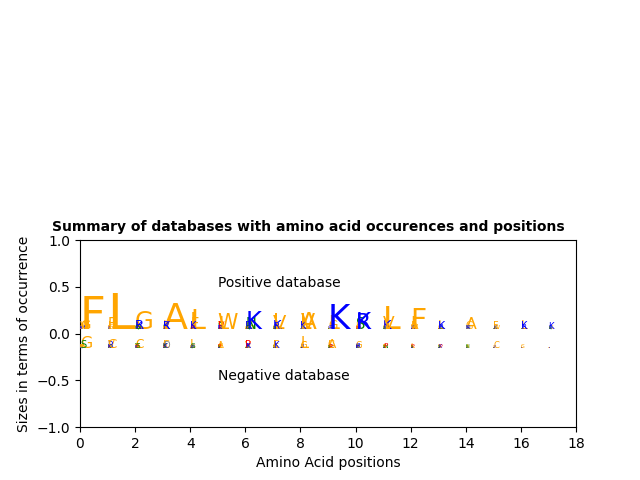

# Enhancing the activity of antimicrobial peptides using _de novo_ approach
This is a public repository for the project in the _de novo_ design of antimicrobial peptides with enhanced activity, created in 2023 by a team of bioengineering students from _Sup'Biotech High Engineering School of Biotechnology_, Villejuif, France.

## Introduction

Found in all classes of living organisms, **antimicrobial peptides (AMPs)** play a crucial role in the innate immune response and barrier defence by killing or inhibiting the growth of harmful microorganisms, including bacteria and fungi. The broad-spectrum activity makes them effective against different types of pests and pathogens, thus prompting the use of AMPs as an alternative to pesticides, which are hazardous for both human health and environment. 

Even though to date several thousands of AMPs have been isolated from different natural sources, only few of them (_nisin, dermaseptin, defensins, cinnamycin_) have been translated to the market, primarily to target multidrug-resistant infections or as food preservatives. 
This is due to several inherent drawbacks of the naturally obtained AMPs, primarily their **short half-life** owing to the susceptibility to protease degradation, and **lower activity as compared to conventional pesticides**, resulting in higher production costs. 

Synthetic AMPs, strengthened by sequence truncation, mutation, cyclization, or introduction of unnatural amino acids, have been shown to retain or improve the antimicrobial potency along with circumventing the disadvantages of the natural analogues.

### Objective

This project aims at developing an algorithm for the de novo design of synthetic AMPs with optimized activity, as compared to those present in living organisms. Our ultimate goal would be to validate the **nanomolar range activity** of the generated sequences against fungal pathogens, by contrast with the micromolar range of natural AMPs. 

## Installation
### Setup using venv

The following code block allows to setup a [virtual environment](https://docs.python.org/3/library/venv.html).

### Dependency management using ```poetry```

```poetry``` is a Python packaging and dependency management tool, simplifying the management of a Python project by providing features such as:

- dependency resolution
- virtual environments
- packaging, and publishing. 

It allows to define project dependencies in ```pyproject.toml``` and the associated ```poetry.lock``` files and handles the installation and management of those dependencies.

To install ```poetry```:

```bash
poetry install
poetry shell
task check
```

To add dependencies specified in ```pyproject.toml```: 

```bash
poetry add <package-name>
```

## Resources 

### Positive Database

The database used to identify positive AMPs' descriptors, ```full_positive_db.fasta```, was exported from [DRAMP](http://dramp.cpu-bioinfor.org) with only alpha-helices selected, due to their enhanced capability to propagate cell membranes.

It was then filtered to select peptides with the length from 3 to 18 amino acids (AA):

```filtered_positive_db.fasta```

### Negative Database 

The database used to identify negative AMPs' descriptors, ```filtered_negative_db.fasta```, was exported from [UniProt](https://www.uniprot.org/) by selecting the intracellular peptides, since it was assumed that they would not be capable of transmembrane transport. 

Selected peptides were subsequently filtered by their length, to keep only short candidates of the length between 3 and 18 AA.

### IC50 Database

The database of AMPs IC50 ```AMPs_DB_IC50.xslx``` was exported from: 

### Module to design Ramachadran plots

[Original repository by _alxdrcirilo_ ](https://github.com/alxdrcirilo/RamachanDraw)

## Project files 

### ```kmer_parser.py```

1. Cures positive and negative databases using a size restriction filter. Only AMPs of the length between **3 and 18 AA** are selected, due to their enhanced antimicrobial activity, confirmed in the literature.

> The **k-mer approach** is a method commonly used in the analysis of protein sequences. It involves breaking down a sequence into shorter subsequences of length _k_, known as _**k-mers**_, and examining the occurrence and properties of these k-mers within the sequence.

2. Creates a temporary directory containing ```.kmr``` files for each peptide sequence with all possible **k-mers** of **size 5 and a maximum of 3 gaps**. 
All generated k-mers are then concatenated to be ranged in accordance to their **activity scores**.

Scoring function is based on the number of descriptor's occurrences in a positive database as compared to the negative one, and is computed as stated below: 

$$
S_{desc}=log( \frac{ occ_{pos} +1 }{occ_{neg} +1} )
$$

The score is added to each key: the couple of the dictionary value and the according activity score are saved in the file ```descriptors_activity_scores.tsv``` 

### ```summarise_db.py``` 

Analyses the frequencies of AA occurring at given positions in positive and negative databases.



### ```generate_peptide.py```

Generates a set of peptides with potential antimicrobial properties by:
1. Introducing random mutations in a randomly generated peptide 
2. Selecting candidates with the highest number of defined positive k-mer descriptors. 
3. Uses ```descriptors_activity_scores.tsv``` file to attribute a score to a given peptide sequence according to descriptors scores computed with ```kmer_parser.py```:

``` Python 
def score_kmers(pep_seq: str, r_dict: int, score_dictionary = None) -> float
```

3. Computing physico-chemical properties for each generated peptide to select those with the highest potential capacity to propagate cell membranes:

``` Python
def pep_physical_analysis (pep_seq: str) -> list [str, float, float, float]
```

- Net charge at pH = 7: _positive preferable due to attraction to the surface of cell membrane_
- Kyte-Doolittle hydrophobicity profile and auto-correlation transformation 
- Distances between hydrophilic domains 
- Helical distribution of AA: _alpha-helices are most preferable_


