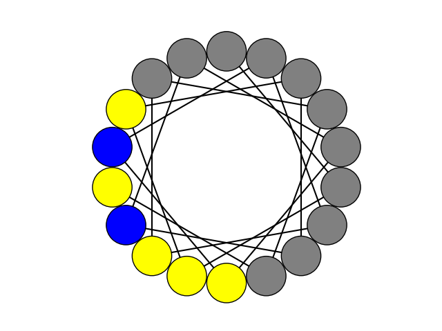

# Anti-Fungal-Peptide
Bio-informatics common repository for antimicrobial peptides design 

## Setup on Windows

The following code block allows you to setup a [virtual environment](https://docs.python.org/3/library/venv.html) on your Windows laptop.

## Installation
```bash
poetry install
```

## Developing
```bash
poetry shell

task check
```
## Ramachandran plot module

Link to the original repo: https://github.com/alxdrcirilo/RamachanDraw

## Databases definition

### Positive Databases 
Positive_db obtained from DRAMP server and only alpha-helixes peptides were selected : http://dramp.cpu-bioinfor.org/
Positive_db_reac_IC50 from 2005 DOI: 

### Negative Database 
Peptide of short size were downloaded on Uniprot server : https://www.uniprot.org/
They were previously filtered for intracellular only presence as it was assumed they would not biologically have a relevant effet againt bacteria and fungy.

## Description of scripts 

###### kmer_parser.py 
Performs database curation (positive and negative) using a size restriction filter : only AMPs in size range 3 to 18 aa are selected.
It creates 2 temporary directory (pos and neg) each containing a kmr file for each peptide sequence containing all possible kmer of size 5 with maximum 3 gaps 
All generated kmers are then concatenated and counted to a dictionnary prior scoring.

Scoring function based on occurence of descriptor in positive relative to negative database is computed as bellow : 

$$S_{desc}=log( \frac{ occ_{pos} +1 }{occ_{neg} +1} )$$

The score is added to each key: value couple of the dictionnary and the global data are saved in file unique_set.tsv 

###### summarise_db.py 
Analyse frequency of aa in database for given positions 

###### peptide_analysis.py 
Computes physico-chemicals properties of peptides based on their sequences
- net charge at pH 
- plot hydrophobicity and autocorrelation transformation 
- spaces between hydrophilic domains 
- helical distribution of aa along helixes 




###### score_peptide.py
Uses unique_set.tsv file to attribute a score to a given peptide sequence according to descriptors scores computed with kmer_parser.py
