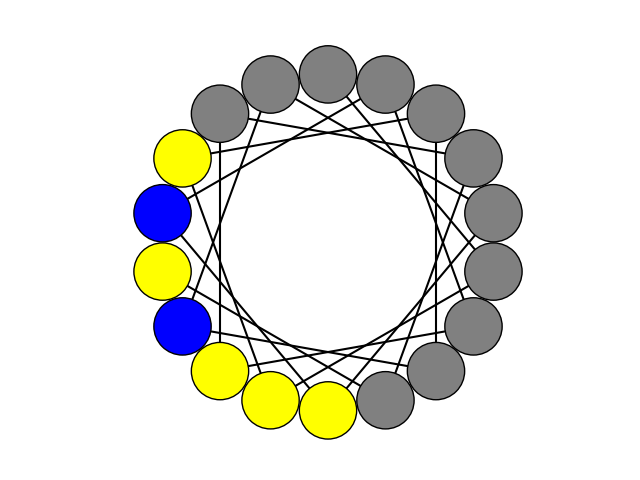

# Anti-Fungal-Peptide
Bio-informatics common repository for antimicrobial peptides design 

## Setup on Windows

The following code block allows you to setup a [virtual environment](https://docs.python.org/3/library/venv.html) on your Windows laptop. If you don't want to use a virtual environment, you can install your packages globally with the last line of the code block.

```bash
python -m venv .venv
source .venv/Scripts/activate # or .\.venv\Scripts\activate.bat if you are using Windows cmd
pip install -r requirements.txt
```
## Ramachandran plot module

Link to the original repo: https://github.com/alxdrcirilo/RamachanDraw


## Description of scripts 

###### Kmer_parser.py 
Performs database curation (positive and negative) using a size restriction filter : only AMPs in size range 3 to 18 aa are selected.
It creates 2 temporary directory (pos and neg) each containing a kmr file for each peptide sequence containing all possible kmer of size 5 with maximum 3 gaps 
Al generated kmers are then concatenated and counted to a dictionnary prior scoring.

Scoring function based on occurence of descriptor in positive relative to negative database is computed as bellow : 

$$S_{desc}=log( \frac{ occ_{pos} +1 }{occ_{neg} +1} )$$

The score is added to each key: value couple of the dictionnary and the global data are saved in file unique_set.tsv 

###### peptide_analysis.py 
Computes physico-chemicals properties of peptides based on their sequences
- net charge at pH 
- plot hydrophobicity and autocorrelation transformation 
- spaces between hydrophilic domains 
- helical distribution of aa along helixes 




###### score_peptide.py
Uses unique_set.tsv file to attribute a score to a given peptide sequence according to descriptors scores computed with kmer_parser.py
