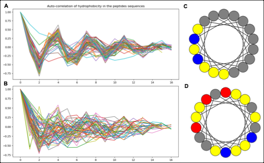

# Enhancing the activity of antimicrobial peptides using _de novo_ approach
This is a public repository for the project in the _de novo_ design of antimicrobial peptides with enhanced activity, created in 2023 by a team of bioengineering students from _Sup'Biotech High Engineering School of Biotechnology_, Villejuif, France.

## Introduction

Found in all classes of living organisms, **antimicrobial peptides (AMPs)** play a crucial role in the innate immune response and barrier defence by killing or inhibiting the growth of harmful microorganisms, including bacteria and fungi. The broad-spectrum activity makes them effective against different types of pests and pathogens, thus prompting the use of AMPs as an alternative to pesticides, which are hazardous for both human health and environment. 

Even though to date several thousands of AMPs have been isolated from different natural sources, only few of them (_nisin, dermaseptin, defensins, cinnamycin_) have been translated to the market, primarily to target multidrug-resistant infections or as food preservatives. 
This is due to several inherent drawbacks of the naturally obtained AMPs, primarily their **short half-life** owing to the susceptibility to protease degradation, and **lower activity as compared to conventional pesticides**, resulting in higher production costs. 

Synthetic AMPs, strengthened by sequence truncation, mutation, cyclization, or introduction of unnatural amino acids, have been shown to retain or improve the antimicrobial potency along with circumventing the disadvantages of the natural analogues.

### Objective

This project aims at developing an algorithm for the de novo design of synthetic AMPs with optimized activity, as compared to those present in living organisms. Our ultimate goal would be to validate the **nanomolar range activity** of the generated sequences against fungal pathogens, by contrast with the micromolar range of natural AMPs. 

## Installation
### Setup using venv

The following code block allows to setup a [virtual environment](https://docs.python.org/3/library/venv.html).

### Dependency management using ```poetry```

```poetry``` is a Python packaging and dependency management tool, simplifying the management of a Python project by providing features such as:

- dependency resolution
- virtual environments
- packaging, and publishing. 

It allows to define project dependencies in ```pyproject.toml``` and the associated ```poetry.lock``` files and handles the installation and management of those dependencies.

To install ```poetry```:

```bash
poetry install
poetry shell
task check
```

To add dependencies specified in ```pyproject.toml```: 

```bash
poetry add <package-name>
```

## Resources 

### Positive Database

The database used to identify positive AMPs' descriptors, ```full_positive_db.fasta```, was exported from [DRAMP](http://dramp.cpu-bioinfor.org) with only alpha-helices selected, due to their enhanced capability to propagate cell membranes.

It was then filtered to select peptides with the length from 3 to 18 amino acids (AA):

```filtered_positive_db.fasta```

### Negative Database 

The database used to identify negative AMPs' descriptors, ```filtered_negative_db.fasta```, was exported from [UniProt](https://www.uniprot.org/) by selecting the intracellular peptides, since it was assumed that they would not be capable of transmembrane transport. 

Selected peptides were subsequently filtered by their length, to keep only short candidates of the length between 3 and 18 AA.

### IC50 Database

The database of AMPs IC50 ```AMPs_DB_IC50.xslx``` was exported from [Fjell et al. (2009)](https://pubmed.ncbi.nlm.nih.gov/19296598/).

### Module to design Ramachadran plots

[Original repository by _alxdrcirilo_ ](https://github.com/alxdrcirilo/RamachanDraw)

## Project files 

### ```kmer_parser.py```

1. Reduces the input sequences of 20 AA in accordance with the so-called _reduction dictionary_, based on the physico-chemical properties of AA. 
In this work we assume that the optimal classification of AA to reduce the complexity of the protein sequence should be based on their **hydrophobicity**, **size**, and **charge** (RED6):

-	**Large hydrophobic (A)**: isoleucine (I), leucine (L), methionine (M), valine (V), tryptophan (W) 
-	**Small hydrophobic (B)**: alanine (A), cysteine (C), phenylalanine (F), glycine (G), proline (P)
-	**Positive hydrophilic (P)**: histidine (H), lysine (K), arginine (R)
-	**Negative hydrophilic (N)**: aspartic acid (D), glutamic acid (E)
-	**Uncharged hydrophilic (U)**: asparagine (N), glutamine (Q), serine (S), threonine (T), tyrosine (Y).


2. Cures positive and negative databases using a size restriction filter. Only AMPs of the length between **3 and 18 AA** are selected, due to their enhanced antimicrobial activity, confirmed in the literature.

> The **k-mer approach** is a method commonly used in the analysis of protein sequences. It involves breaking down a sequence into shorter subsequences of length _k_, known as _**k-mers**_, and examining the occurrence and properties of these k-mers within the sequence. A k=5 size was selected for generation of k-mer descriptors because it enabled the integration of all stabilization interaction found in helices (_i + 3_; _i + 4_; _i + 5_) without being too large for interpretation.

3. Creates a temporary directory containing ```.kmr``` files for each peptide sequence with all possible **k-mers** of **size 5 and a maximum of 3 gaps**. 
All generated k-mers are then concatenated to be ranged in accordance with their **activity scores**.

Scoring function is based on the number of descriptor's occurrences in a positive database as compared to the negative one, and is computed as stated below: 

$$
S_{desc}=log( \frac{freq_{pos} +1 }{freq_{neg} +1} )
$$

The score is added to each key: the couple of the dictionary value and the according activity score are saved in the file ```descriptors_activity_scores.tsv``` 

### ```summarise_db.py``` 

Analyses the frequencies of AA at given positions in positive and negative databases.


### ```generate_peptide.py```

Generates a set of peptides with potential antimicrobial properties by:
1. A _loop approach_, comprising of the introduction of random mutations in peptides from the positive database: 1 mutation in 1 AA per iteration, in compliance with the probabilities of the substitution matrix.
2. After each iteration, a sequence is monitored for the presence of active and killer descriptors and attributed a score in accordance with descriptors_activity_scores.tsv file, equal to the sum of activity scores of every single descriptor present in the sequence. 
3. If the calculated sum is higher than the original score, the mutated peptide is added to the candidate AMPs library. The candidates with the highest activity scores are selected as potential AMP candidates for the _in vitro_ testing.

``` Python 
def score_kmers(pep_seq: str, r_dict: int, score_dictionary = None) -> float
```

4. Computing physico-chemical properties for each generated peptide to select those with the highest potential capacity to propagate cell membranes:

``` Python
def pep_physical_analysis (pep_seq: str) -> list [str, float, float, float]
```

a.	**Net charge at pH = 7**. Positively charged peptides are preferable due to their attraction to the surfaces of cell membranes.

b.	**Kyte-Doolittle hydrophobicity profile** with auto-correlation transformation is employed to calculate the periodicity of the helix as the average distance between hydrophobic and hydrophilic residues. 

c.	If the periodicity is close to 4, we suppose that the peptide is an **α-helix** as consistent with _i + 4_ periodicity pattern. 

Due to the amphiphilic properties of α-helices and their capability of transmembrane transport, they are considered as the **most prominent secondary structure for AMPs**. 

The helical structure can be further validated using helical wheel with the help of `helixvis` or `AlphaFold 2`.




**A** and **B** line charts represent auto-correlation of peptide hydrophobicity profiles (Eisenberg consensus scale using Biopython `Protparam` library) in positive and negative databases, respectively. 

Panels **C** and **D** represent amino acids distribution along the helical wheels in positive and negative examples, respectively. _Color code: gray = hydrophobic; yellow = polar; blue = basic; red = acidic._ Generated with `helixviz` library. 

### `correlation_score_IC50.py`

Employs **Support Vector Classifier (SVC)** to discriminate between high and low activity AMPs using available data on IC50 values from [Fjell et al. (2009)](https://pubmed.ncbi.nlm.nih.gov/19296598/). The model takes into account hydrophobicity, descriptor-based activity scores and _in vivo_ aggregation score (a3v_Sequence_Average) generated by [Aggrescan](http://bioinf.uab.es/aggrescan/).

The ultimate goal of using SVC is to eliminate peptides of potentially low antimicrobial activity. 

> **SVC** is a type of supervised machine learning algorithm used to find an optimal hyperplane that discriminates the data points into different classes or predicts a continuous value. 

Here, SVC is used to create a distinction within a training dataset between more than 2 variates, with the estimation of the false positive and false negative classification confidence. As a result, a bivariate density plot is obtained after over 1000 cycles of the SVC repetition. 


